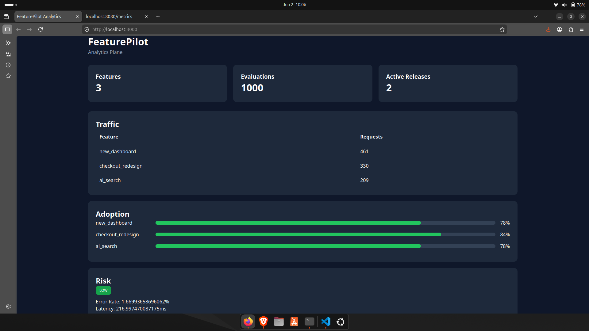
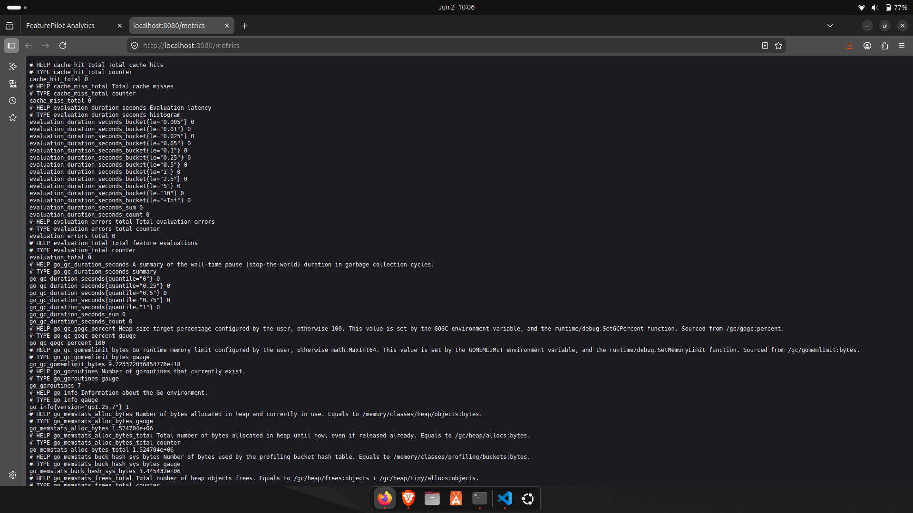
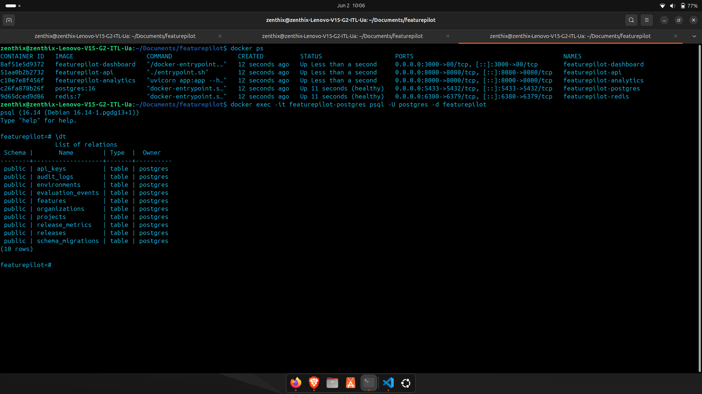
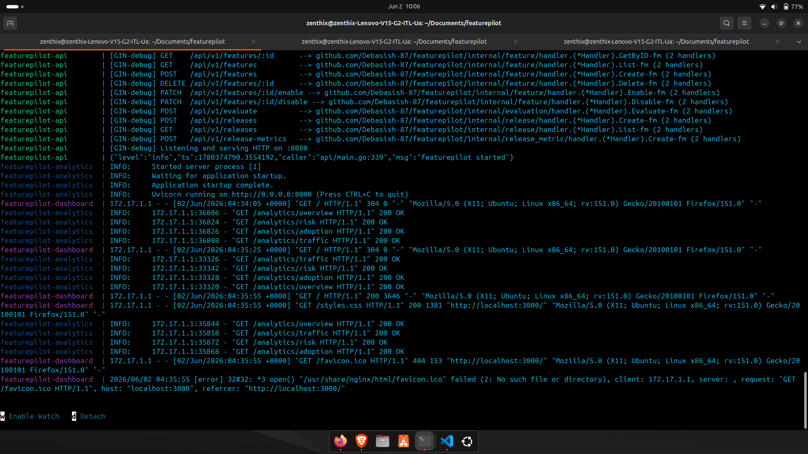

# FeaturePilot

FeaturePilot is an open-source feature flag and progressive delivery platform built for modern applications. It enables teams to safely release features, perform percentage-based rollouts, manage environments, track feature evaluations, and monitor release health through analytics and audit trails.

## Overview

FeaturePilot provides:

- Feature flag management
- Progressive rollouts
- Environment isolation
- Release management
- Evaluation event tracking
- Audit logging
- Analytics dashboard
- Redis-backed evaluation caching
- PostgreSQL persistence
- Docker-based deployment

## Architecture

```text
                    +----------------+
                    |   Dashboard    |
                    |   (Nginx UI)   |
                    +--------+-------+
                             |
                             v
+-------------+     +----------------+      +-------------+
| Application | --> | FeaturePilot   | -->  | PostgreSQL  |
| / SDK       |     | API (Go)       |      | Database    |
+-------------+     +----------------+      +-------------+
                             |
                             v
                     +---------------+
                     | Redis Cache   |
                     +---------------+
                             |
                             v
                     +---------------+
                     | Analytics API |
                     | (Python)      |
                     +---------------+
````

## Core Features

### Feature Flags

Create and manage feature flags across multiple environments.

* Enable or disable features instantly
* Environment-specific configuration
* Unique feature keys per environment

### Progressive Rollouts

Gradually expose features to users using deterministic rollout percentages.

```text
Rollout Percentage: 25%

Users:
✓ User A
✓ User B
✗ User C
✗ User D
```

FeaturePilot uses deterministic user bucketing to ensure rollout consistency.

### Environment Management

Support for multiple deployment environments:

* Development
* Staging
* Production
* Custom environments

### Release Management

Track releases and deployment status.

Supported release states:

* Active
* Failed
* Rolled Back

### Audit Logging

Every critical action can be tracked:

* Feature creation
* Feature enablement
* Feature disablement
* Release operations

### Evaluation Tracking

Every feature evaluation can be stored for analytics purposes.

Captured data:

* Environment
* Feature key
* User ID
* Evaluation result
* Timestamp

### Analytics Dashboard

Monitor:

* Total feature evaluations
* Feature adoption
* Traffic distribution
* Release health
* Risk indicators

## Technology Stack

### Backend

* Go
* Gin
* PostgreSQL
* Redis
* Prometheus

### Analytics Service

* Python
* FastAPI

### Frontend

* HTML
* CSS
* Nginx

### Infrastructure

* Docker
* Docker Compose

## Database Schema

### Organizations

```sql
organizations
├── id
├── name
├── created_at
└── updated_at
```

### Projects

```sql
projects
├── id
├── organization_id
├── name
├── created_at
└── updated_at
```

### Environments

```sql
environments
├── id
├── project_id
├── name
├── created_at
└── updated_at
```

### Features

```sql
features
├── id
├── environment_id
├── key
├── name
├── description
├── enabled
├── rollout_percentage
├── created_at
└── updated_at
```

### Releases

```sql
releases
├── id
├── project_id
├── version
├── status
└── created_at
```

### Evaluation Events

```sql
evaluation_events
├── id
├── environment
├── feature_key
├── user_id
├── enabled
└── created_at
```

### Audit Logs

```sql
audit_logs
├── id
├── action
├── entity_type
├── entity_id
├── metadata
└── created_at
```

## Quick Start

### Prerequisites

* Docker
* Docker Compose

### Run the Platform

```bash
chmod +x run.sh
./run.sh
```

Or:

```bash
docker compose up -d
```

## Services

| Service          | URL                                                      |
| ---------------- | -------------------------------------------------------- |
| Dashboard        | [http://localhost:3000](http://localhost:3000)           |
| Analytics API    | [http://localhost:8000/docs](http://localhost:8000/docs) |
| FeaturePilot API | [http://localhost:8080](http://localhost:8080)           |
| PostgreSQL       | localhost:5433                                           |
| Redis            | localhost:6380                                           |


## Screenshots

### Dashboard

Feature flag management dashboard with rollout controls, release visibility, and analytics.



### Metrics

Prometheus metrics and monitoring for evaluation tracking and system health.



### Docker and Database

FeaturePilot services running with PostgreSQL and Redis using Docker Compose.



### All Containers Running

Complete FeaturePilot platform running successfully.




## API Example

### Create Feature

```http
POST /features
Content-Type: application/json

{
  "environment_id": "env-id",
  "key": "new_checkout",
  "name": "New Checkout",
  "description": "Next generation checkout flow",
  "rollout_percentage": 20
}
```

### Evaluate Feature

```http
POST /evaluate
Content-Type: application/json

{
  "environment": "production",
  "feature_key": "new_checkout",
  "user_id": "user-123"
}
```

Response:

```json
{
  "enabled": true
}
```

## Caching Strategy

Evaluation results are cached in Redis.

Cache key format:

```text
feature:<environment>:<feature_key>:<user_id>
```

Benefits:

* Lower database load
* Faster evaluations
* Consistent rollout decisions

## Monitoring

Prometheus metrics are exposed for:

* Total evaluations
* Cache hits
* Cache misses
* Evaluation errors
* Evaluation latency

## Project Structure

```text
cmd/
├── api/

internal/
├── organization/
├── project/
├── environment/
├── feature/
├── release/
├── evaluation/
├── evaluation_event/
├── audit/
├── cache/
├── metrics/
└── database/

analytics-service/
├── api/
├── repositories/
└── services/

dashboard/
├── index.html
├── styles.css
└── nginx.conf

migrations/
docker-compose.yml
Dockerfile
```

## Development

### Run Database Migrations

Migrations are automatically executed during container startup.

Migration files are located in:

```text
migrations/
```

### Rebuild Containers

```bash
docker compose down

docker compose build --no-cache

docker compose up -d
```

## Roadmap

* SDKs for Go, Node.js, and Python
* Multi-tenant authentication
* Targeting rules
* Segment-based rollouts
* Canary deployments
* Webhook integrations
* OpenFeature compatibility
* Distributed cache invalidation
* Real-time analytics

## License

MIT License.

## Author

FeaturePilot is designed as a lightweight, self-hosted feature management and progressive delivery platform for engineering teams that require control, observability, and safe release workflows.
